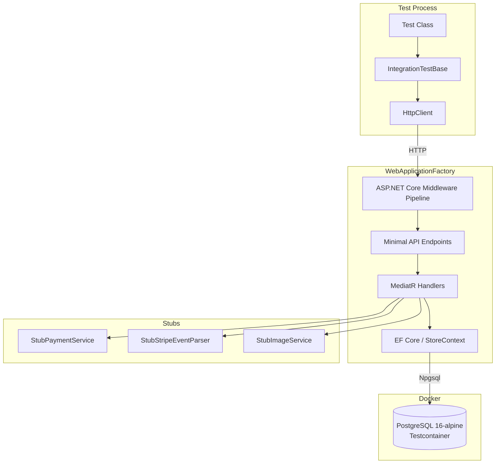
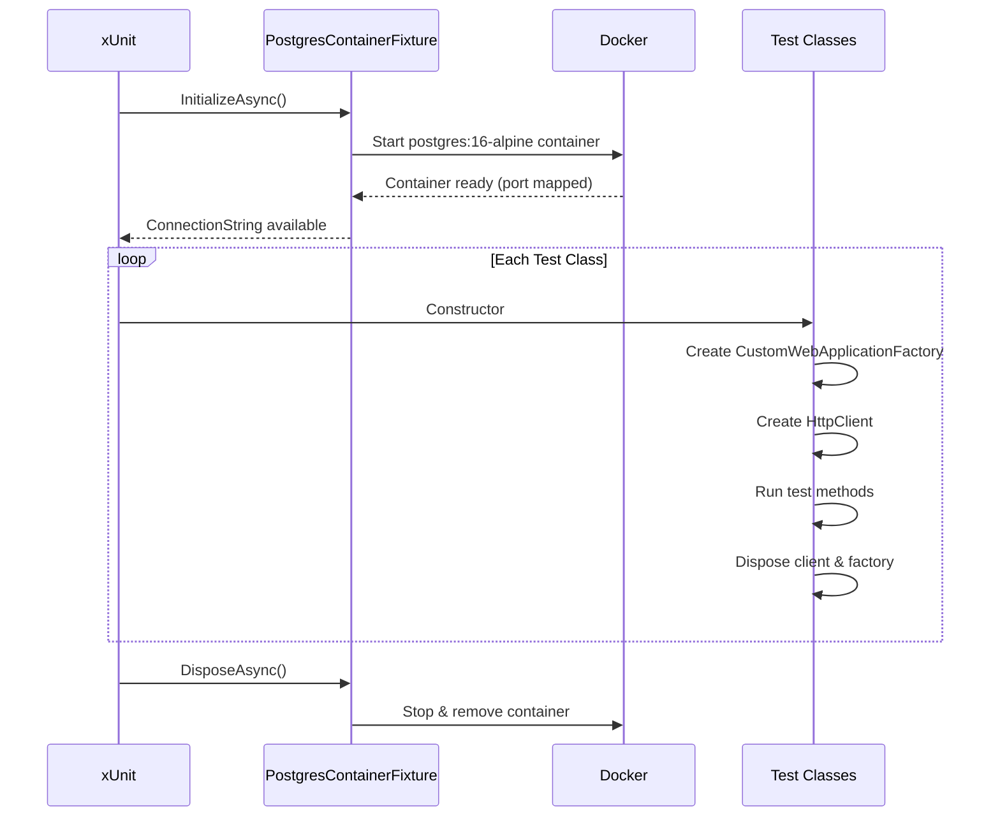
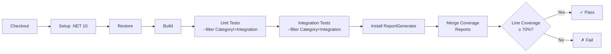

# Integration Tests

End-to-end API tests that exercise the full request pipeline — from HTTP request through Minimal API endpoints, MediatR handlers, EF Core, and a real PostgreSQL database — using [Testcontainers](https://testcontainers.com/) and `WebApplicationFactory<Program>`.

## Strategy

Integration tests validate that the API endpoints behave correctly when all layers work together. They complement the unit tests (which isolate individual handlers and validators) by verifying:

- HTTP routing, status codes, and response shapes
- Authentication and authorization enforcement
- Database persistence across request boundaries (e.g., add to basket then retrieve)
- Middleware and pipeline behavior (CORS, error handling, pagination headers)
- Service registration and dependency injection wiring

External services (Stripe, Cloudinary) are stubbed at the DI level so tests remain fast, deterministic, and free of third-party API calls.

## Architecture



## Test Infrastructure

### Shared PostgreSQL Container

All integration test classes share a single PostgreSQL container via xUnit's `ICollectionFixture` pattern. The container starts once before the first test runs and is disposed after the last test completes.



### Key Components

| Component                     | File                                    | Responsibility                                                                                            |
| ----------------------------- | --------------------------------------- | --------------------------------------------------------------------------------------------------------- |
| `PostgresContainerFixture`    | `Fixtures/PostgresContainerFixture.cs`  | Manages PostgreSQL container lifecycle via Testcontainers                                                 |
| `IntegrationTestCollection`   | `Fixtures/IntegrationTestCollection.cs` | `[CollectionDefinition]` binding the fixture to the `"Integration"` collection                            |
| `CustomWebApplicationFactory` | `CustomWebApplicationFactory.cs`        | Overrides `WebApplicationFactory<Program>` to swap DbContext connection string and stub external services |
| `IntegrationTestBase`         | `IntegrationTestBase.cs`                | Abstract base class providing `HttpClient`, `AuthenticateAsync()` helper, and `IDisposable` cleanup       |

### Stubbed Services

The `CustomWebApplicationFactory` replaces three external service interfaces at the DI level:

| Interface            | Stub                    | Behavior                                          |
| -------------------- | ----------------------- | ------------------------------------------------- |
| `IPaymentService`    | `StubPaymentService`    | Returns a fake `PaymentIntent` with `pi_test_123` |
| `IStripeEventParser` | `StubStripeEventParser` | Returns a succeeded `Charge` event                |
| `IImageService`      | `StubImageService`      | Returns success paths for add/update/delete       |

### Authentication in Tests

The `IntegrationTestBase.AuthenticateAsync()` method logs in as the seeded `bob` user (password `Admin_1234`) via the real `/api/account/login` endpoint and sets the `Authorization: Bearer {token}` header on the shared `HttpClient`.

## Test Coverage by Endpoint

| Test Class              | Endpoint Module  | Tests | Key Scenarios                                                             |
| ----------------------- | ---------------- | ----- | ------------------------------------------------------------------------- |
| `ProductsEndpointTests` | `ProductsModule` | 6     | List products, pagination header, get by ID, invalid/negative ID, filters |
| `BasketEndpointTests`   | `BasketModule`   | 4     | No basket, add item, get after add, remove item                           |
| `AccountEndpointTests`  | `AccountModule`  | 6     | Login valid/invalid, register new/duplicate, current user auth/unauth     |
| `OrdersEndpointTests`   | `OrdersModule`   | 4     | Get orders, get by ID 404, create full flow, unauthenticated              |
| `PaymentsEndpointTests` | `PaymentsModule` | 2     | Unauthenticated 401, create payment intent                                |

## CI/CD Pipeline

The `build-and-test.yaml` workflow runs both unit and integration tests on every push and PR, then enforces a coverage threshold.



Integration tests work on `ubuntu-latest` out of the box because Docker is pre-installed on GitHub-hosted runners. Testcontainers automatically detects the Docker daemon and manages the PostgreSQL container lifecycle.

## Running Locally

### Prerequisites

- Docker Desktop running
- .NET 10 SDK

### Commands

Run integration tests only:

```powershell
dotnet test Restore.sln --filter "Category=Integration" --verbosity normal
```

Run all tests (unit + integration):

```powershell
dotnet test Restore.sln --verbosity normal
```

### Troubleshooting

| Symptom                           | Cause                                          | Fix                                                                             |
| --------------------------------- | ---------------------------------------------- | ------------------------------------------------------------------------------- |
| `Docker is not running` error     | Docker Desktop not started                     | Start Docker Desktop                                                            |
| Container startup timeout         | Slow image pull on first run                   | Run `docker pull postgres:16-alpine` manually                                   |
| Port conflict                     | Another PostgreSQL instance on the mapped port | Testcontainers uses random ports — conflicts are rare; restart Docker if needed |
| Tests pass locally but fail in CI | Environment differences                        | Check the GitHub Actions logs for the `Integration Tests` step                  |
